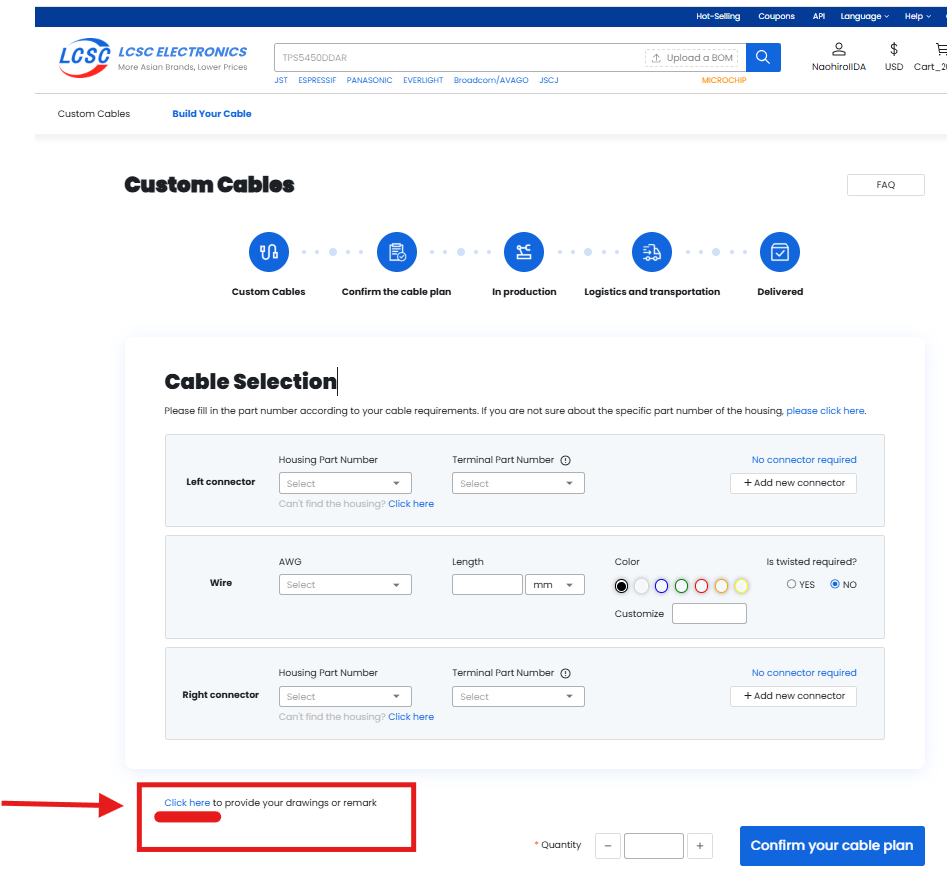
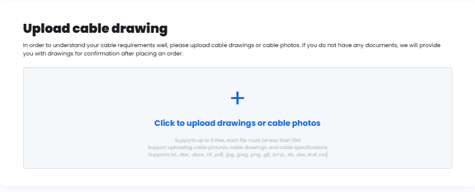

# LCSC Custom Cable Order Guide (OpenArm Example)

This document introduces the procedure used in the OpenArm project to order custom cables through LCSC.

LCSC's custom cable service allows you to upload a simple wiring diagram (PDF or PNG) to place orders without using the predefined website menus, enabling flexible cable specifications.

---

## Target Project

- OpenArm (Open-source robotic arm)  
  https://openarm.dev/
- Wiring specification  
  https://docs.openarm.dev/hardware/electronics-guide/arm-wiring-and-casing
- Bill of Materials (BOM)  
  https://docs.openarm.dev/hardware/bill-of-materials/electrical

---

## Order Procedure

### 1. Prepare a Drawing

Create a drawing (PDF or PNG) that includes the following items:

- 1: Connector type – select from LCSC's site and include the **LCSC Part #**
- 2: Cable length diagram (e.g., 300 mm)
- 3: Pin layout diagram (e.g., GND, VCC)
- 4: Number of cables to order (e.g., 10 pcs) — optional
- 5: Optional notes such as heat shrink, sleeve, jacket, etc.

---

### 2. Upload to LCSC and Request Quotation

1. After creating an LCSC account, go to https://lcsc.com/customcables
2. Click “Get a Quote”  
   

3. Scroll all the way down the page and click the **very inconspicuous** “provide your drawings or remark” section to upload your diagram.

5. Enter quantity and other details, then click “Confirm your cable plan”.

---

### 3. Quotation and Payment

- About 1 business day later, a quotation will appear on the “Order Management” screen
- If everything looks good, proceed with payment (e.g., via PayPal)

---

### 4. Confirm the Manufacturing Drawing

- About 1 business day later, you will receive a PDF manufacturing drawing from LCSC
- **Please check the following carefully:**
  - Connector part number
  - Pin layout
  - Cable length, color, sleeve specifications

  
  

- If there are issues, reject the drawing, comment on the corrections, and wait for the updated version.  
  If everything is OK, click “Confirm” to begin production.

---

### 5. Manufacturing and Shipping

- After confirmation, manufacturing takes about 5–10 business days
- A few days later, the cables will arrive in Japan

  
  

---

## Tips and Notes

- To avoid errors, choose connectors that are in stock on LCSC  
- Hand-drawn diagrams are acceptable, but must be clearly understandable  
- Indicate connector pin numbers, cable length, and wire color/thickness accurately  
- Simple English for communication is OK — Google Translate is usually sufficient  
- LCSC’s manufacturing drawings often contain mistakes — carefully review and request corrections if necessary

---

## Sample Drawings / Files

- [Cable_order20.drawio (4).pdf](images/Cable_order20.drawio%20(4).pdf)
- [XL2506130075-1(D) (2).pdf](images/XL2506130075-1(D)%20(2).pdf)

---

## Other Language Versions

- 日本語版: [custom-cable-guide.ja.md](./custom-cable-guide.ja.md)
