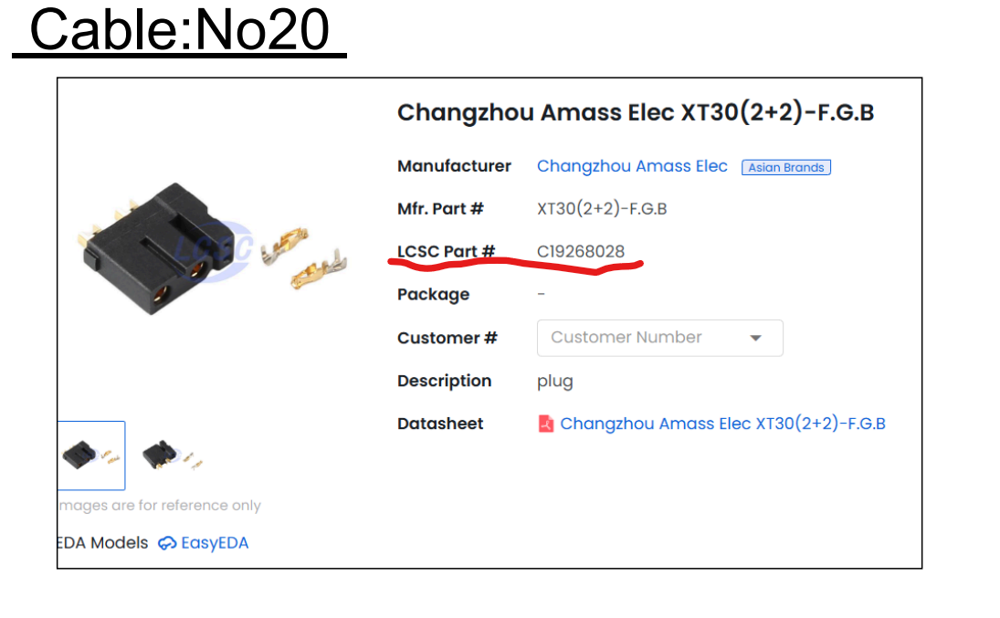
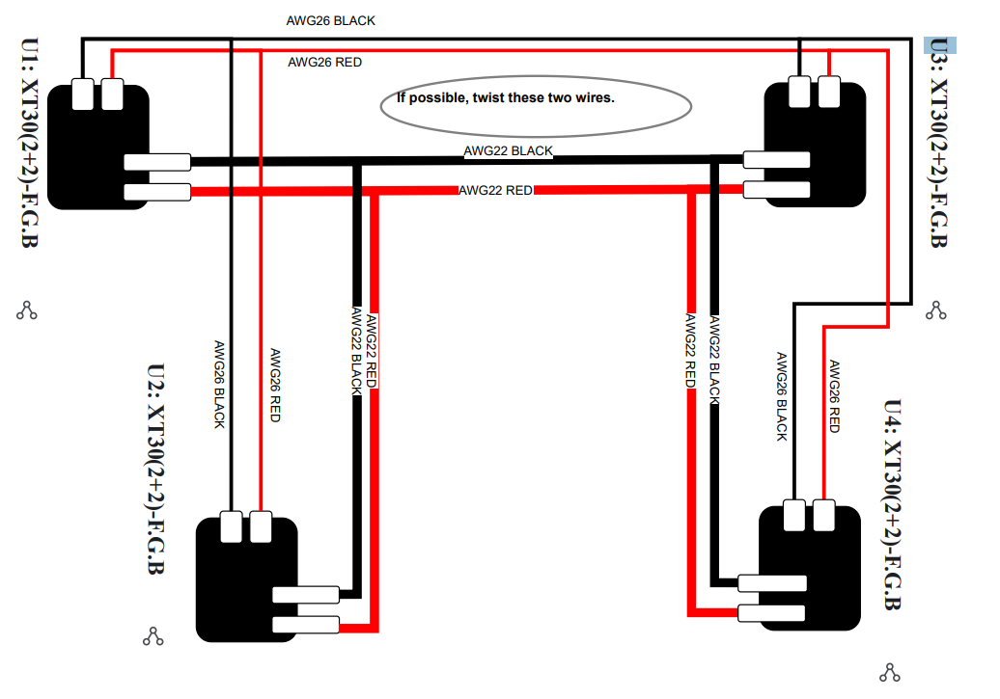
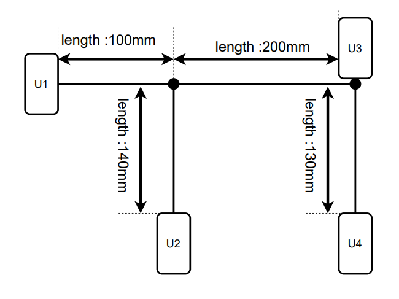
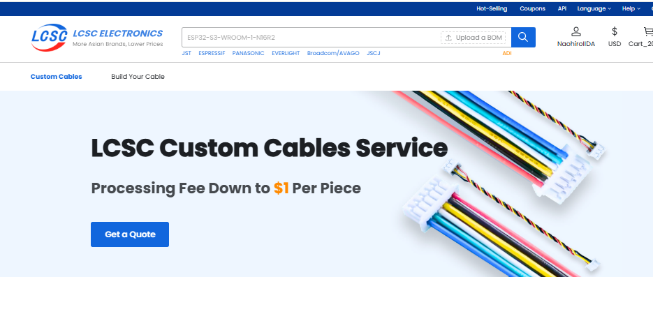
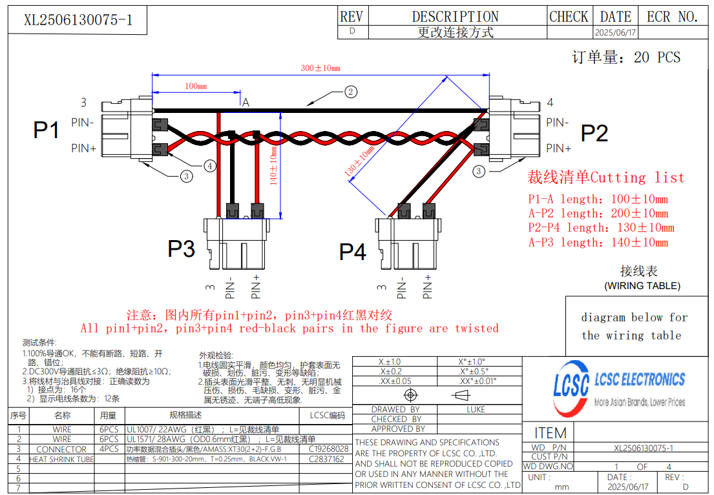
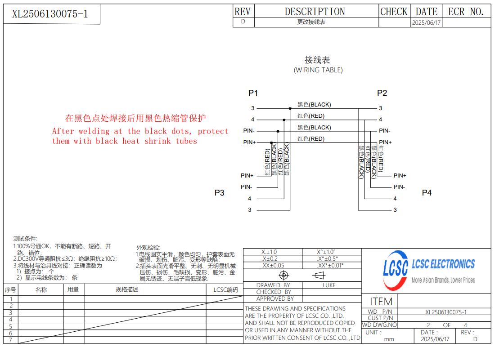
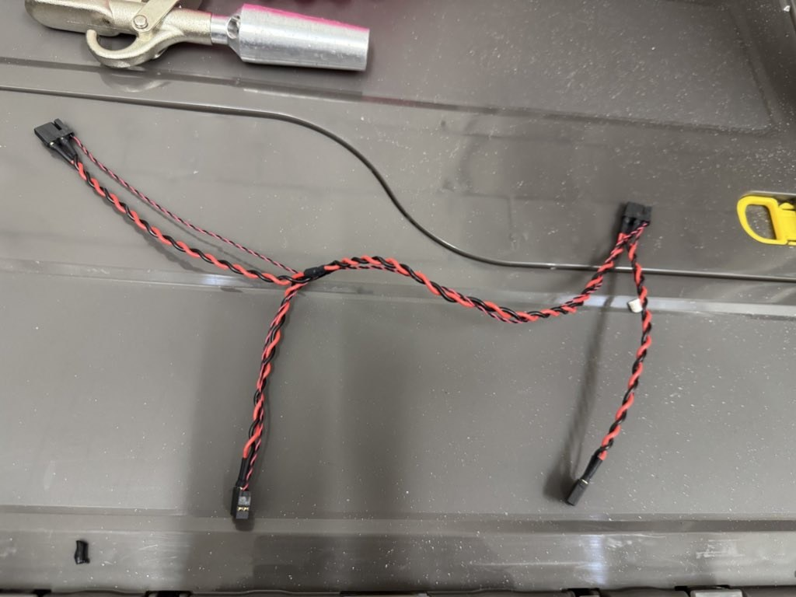

# LCSC カスタムケーブル発注ガイド（OpenArm実例）

このドキュメントでは、OpenArm プロジェクトで実際に使用した LCSC のカスタムケーブル発注手順について紹介します。

LCSC のカスタムケーブルサービスでは、簡単な配線図（PDFやPNG）をアップロードすることで、メニューを使わずに柔軟な仕様のケーブルを注文できます。

---

## 対象プロジェクト

- OpenArm（オープンソースロボットアーム）  
  https://openarm.dev/
- 配線仕様  
  https://docs.openarm.dev/hardware/electronics-guide/arm-wiring-and-casing
- 電子部品表（BOM）  
  https://docs.openarm.dev/hardware/bill-of-materials/electrical

---

## 発注手順

### 1. 図面を用意する

以下の項目を記載した図面（PDFまたはPNG）を用意します：

- 1: コネクタの種類:必ずLCSCのページから選び、LCSC Part #を記入
- 2: ケーブルの長さ図（例：300mm）
- 3: ピン接続図（例：GND, VCC）
- 4: 発注する本数（例：10本）不要かも
- 5: 収縮チューブ・被覆・スリーブ等の特記事項（任意）

---

### 2. LCSCにアップロードして見積依頼

1. LCSCのアカウントを取得後、[https://lcsc.com/customcables](https://lcsc.com/customcables)にアクセス
2. 「get a Quote」をクリック

3. 画面を下の方までスクロールし、**とても目立たない** 「provide your drawings or remark」をクリックして製作した図面をアップロード

5. 数量などを入力し、「Confirm your cable plan」をクリック

---

### 3. 見積と支払い

- 約1営業日後、「注文管理」画面に見積もりが表示されます
- 問題なければPayPalなどで支払いを行います

---

### 4. 製造図面の確認

- さらに1営業日前後で、LCSCから製造用の図面（PDF）が届きます
- 以下の点を**必ず慎重に確認してください**：
  - コネクタの型番
  - ピン配列
  - ケーブルの長さ、色、スリーブ指定など
    
  
  

- 問題がある場合はrejectして修正点を記入し、再度図面が更新されるまで待ちます。
　問題が無ければ「Confirm」をクリックすると、ケーブル製造が開始されます。

---

### 5. 製造と出荷

- Confirm後、5〜10営業日で製造が完了し、出荷されます
- 数日後、日本国内に到着します

  
  

---

## 注意点・コツ

- コネクタの型番はLCSCで在庫があるものを選択すると間違いない  
- 図面は手書きでも可。ただし誤解のない明確な表記にする  
- 接続するコネクタのピン番号・長さ・ケーブルの色／太さを正確に！
- 英語のメールはシンプルな表現でOK（Google翻訳で十分）
- 先方からの製造図面、けっこう間違っている場合もあるので、慎重にチェック＆修正依頼する事

---

## 図面・資料（サンプル）

- [Cable_order20.drawio (4).pdf](images/Cable_order20.drawio%20(4).pdf)
- [XL2506130075-1(D) (2).pdf](images/XL2506130075-1(D)%20(2).pdf)

---

## このドキュメントの他言語版

- English version: [custom-cable-guide.en.md](./custom-cable-guide.en.md)
